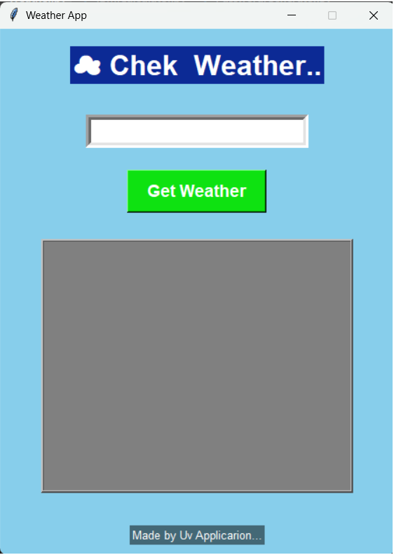

🔗Weather App - Task 4
____________________________________________________________
🔗Overview
________________________________________________
 This project is a simple Weather Application developed using Python.
 The application fetches real-time weather information of any city using the OpenWeatherMap API and displays details like temperature, humidity, wind speed, pressure, and weather condition.
_____________________________________________________________
🔗Features
________________________________________________________
 Real-time weather updates
 User-friendly GUI using Tkinter
 Displays temperature, humidity, pressure, and wind speed
 Weather condition display
 Error handling for invalid city names
 Attractive and simple interface
 _________________________________________________________________
🔗Technologies Used
__________________________________________________________________
 Python
 Tkinter
 Requests Library
 OpenWeatherMap API
 ___________________________________________________________________
🔗How It Works
_______________________________________________________________________
 User enters the city name.
 Application sends request to OpenWeatherMap API.
 API returns live weather data in JSON format.
 Application displays weather details on the screen.
 ___________________________________________________________
🔗Output
______________________________________________________________________
🔗Main Interface

   User can enter any city name.
   Click on “Get Weather” button.
🔗Weather Details Displayed
  Temperature
  Humidity
  Speed
  Pressure
  Weather Condition
  ______________________________________________________________
🔗Output Screenshots
__________________________________________________________________

🔗 Main Weather Interface

🔗 Weather Details

_________________________________________________________________
🔗Author
______________________________________________________________
Yuvraj Ingalkar
_____________________________________________________________________
